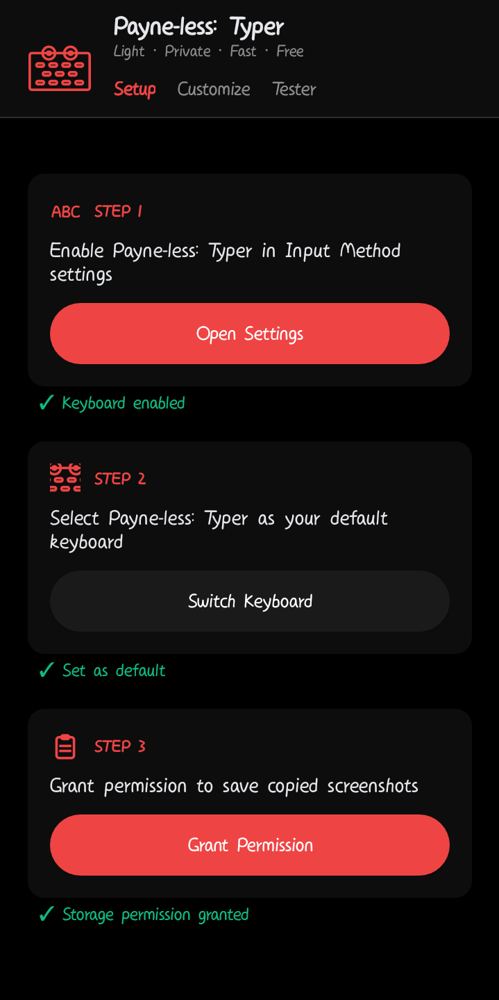
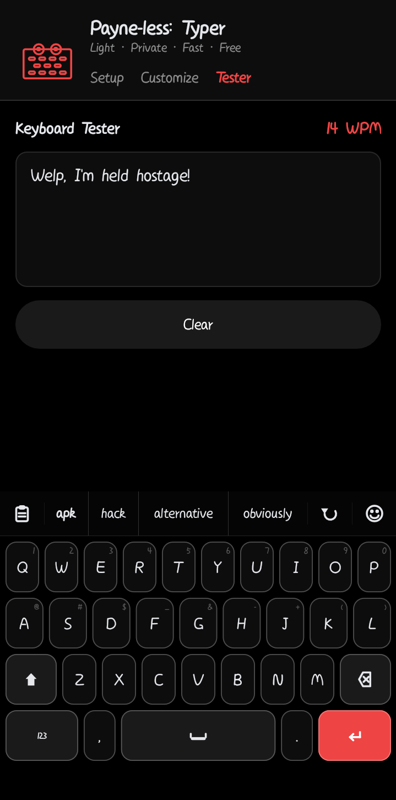
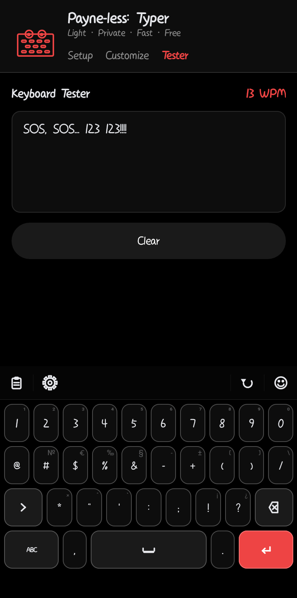
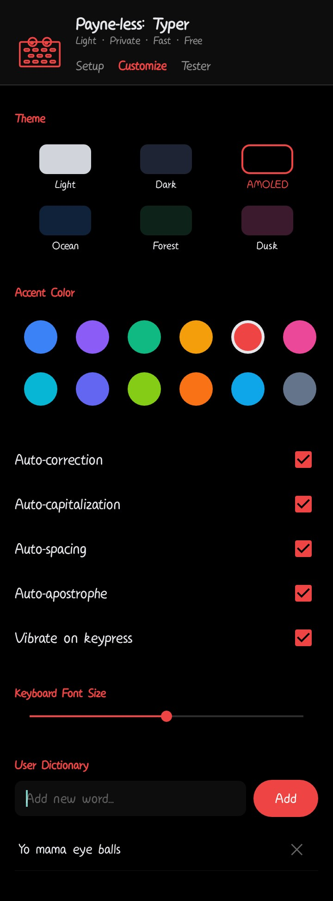
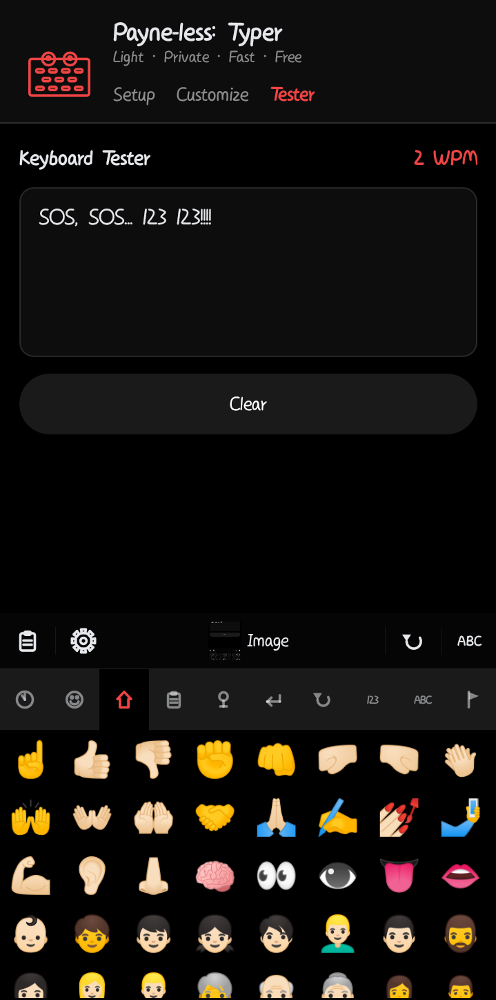
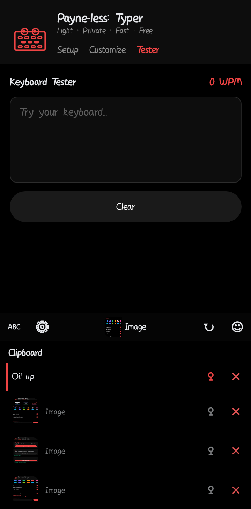

# Payne-less: Typer (SwiftLite)

Welcome to Payne-less: Typer! You might see it called SwiftLite in the code, but to the world, it's the keyboard that just works without making your phone sweat.

This is a super lightweight Android keyboard built from the ground up in pure Java. We ditched 'em heavy XML layouts and went for custom canvas drawing to keep things incredibly fast and tiny.

## TL;DR

**Typer:** *"I am a keyboard. I type characters. I consume almost no resources and respect your privacy."*

**Typer:** *"If you want Gboard with every cloud and AI feature known to mankind, I'm not it."*

## The Good Stuff

We've packed in everything you actually need for daily typing:

*   **Smart Typing:** Live suggestions as you type, plus it guesses your next word before you even hit a key. The prediction engine actually *learns* your writing patterns over time using bigram models, so the more you type, the smarter it gets.
*   **Auto-Correct:** It actually fixes your typos (like grammar slips and spatial misses) without being annoying.
*   **Contraction Expansion:** Type `im` and it becomes `I'm`. Type `dont` and it becomes `don't`. It handles casing too so you never end up with a weird `i'm` at the start of a sentence.
*   **Auto-Capitalize:** First letter of every sentence, automatically. You can turn it off if you're that kind of person.
*   **Long-Press Alternates:** Hold down any key and a popup shows all the alternate characters. Great for accented letters and symbols without switching layouts.
*   **Undo:** There's an undo button right in the suggestion bar. It sends a standard Ctrl+Z, so it works in any app that supports it.
*   **Key Previews:** A little magnified bubble pops up above each key as you press it, so you always know what you just typed.
*   **Haptic Feedback:** Every key's a vibrator of different magnitudes. Optional if you prefer silence.
*   **Emoji Central:** All your favorite emojis with a proper skin tone picker. It even remembers the ones you use most.
*   **Suggested Emojis:** Typing an emoji's name will show relevant emojis in suggestions panel. No need to open emoji panel if you feel lazy!
*   **Clipboard Memory:** A built-in manager that remembers your last 20 copies, including images. You can pin the stuff you use all the time so it never gets deleted. You can also share content straight into the clipboard from any app using the Android share sheet.
*   **Your Own Dictionary:** Teach the keyboard new words it doesn't know. Add slang, names, or technical jargon, and it'll start suggesting them like anything else.
*   **Takes Rejections Seriously!:** Auto-correct correcting a perfectly fine word? Backspacing will remove the auto-correct, 3+ rejections for the same word prevent auto-correct on it.
*   **Themes:** Pick between Light, Dark, Forest, Ocean, or full AMOLED black. You can even swap between 8 different accent colors to match your vibe. Font size is adjustable too.
*   **Number Row**: Use numbers frequently? Enable number row and the keyboard displays numbers in alphabetical keyboard and an emoji row in numerical keyboard.
*   **Privacy:** No internet permission. Period. Your data stays on your phone where it belongs. No analytics, telemetry, cloud sync, or account sign-ins.
*   **Sensitive Field Detection:** Prevents suggestions and learning new words from fields requiring sensitive info such as email, PIN, password.
*   **The Secret:** Use it daily or type the **codeword** and unlock a little surprise! (There's also a hidden visual easter egg in the suggestion bar, just saying.)

## How it Performs

We spent a lot of time making sure this app doesn't hog your resources.

*   **Memory (RAM):** It usually sits between 19MB and 25MB of RAM in Hidden State and ~40MB when actively used. (Used ADB profiling)
*   **Storage:** The entire app takes up about 4MB on your phone. The main dictionary is a lean 5MB file.
*   **Speed:** Since we draw the keys directly to the screen (no slow Button views), the keyboard pops up instantly.

## Minimum Requirements

* **Android Version:** Android 8.0 (Oreo/API 26).
* **Google Services:** Nope.
* **Internet Connection:** Nope. 
* **Permissions:** Storage and External Media (optional, images in clipboard), Vibrate <sub><sub><sub>(can be used for your kinky stuff)</sub></sub></sub>
* **RAM:** 1.0 GB
* **DISK SPACE:** 50MB
  
* **Custom ROMs:** This keyboard was made entirely on a de-Googled Android 8.1 device. It should work on GrapheneOS, LineageOS, Stock Android (AOSP), and most custom ROMs<sup>*</sup>.<sup>**</sup>
  
<sub>* Test yourself</sub>
<sub>** Suggestion quality partly depends on the Android system spell checker, which may behave differently if you've replaced or removed the default.</sub>
## Maximum Requirements:

* **Android Version:** Android 16 (Baklava <sub><sub>
Chocolava 🤤
</sub></sub>, API 36)

## Feast your eyes

#### Shot on Android 8.1

<table>
<tr>
<td align="center">
<br>
<b>Setup Wizard</b>
</td>

<td align="center">
<br>
<b>Typing & Predictions</b>
</td>

<td align="center">
<br>
<b>Numbers & Symbols</b>
</td>
</tr>

<tr>
<td align="center">
<br>
<b>Customization</b>
</td>

<td align="center">
<br>
<b>Emoji Panel</b>
</td>

<td align="center">
<br>
<b>Clipboard Manager</b>
</td>
</tr>
</table>

<sub>Fonts, Emojis, Rendered Visual are subjected to Android Version and Hardware, please understand this statement before commenting</sub>
  
## Folder Structure

<details>
<summary><b>Project Structure</b></summary>

```text
SwiftKey-Lite
├── .github
│   ├── ISSUE_TEMPLATE
│   │   ├── bug_report.md
│   │   ├── config.yml
│   │   └── feature_request.md
│   ├── workflows
│   │   ├── android.yml
│   │   ├── gradle.yml
│   │   └── release.yml
│   └── PULL_REQUEST_TEMPLATE.md
├── app
│   ├── release
│   ├── src
│   │   └── main
│   │       ├── @xml
│   │       ├── assets
│   │       │   ├── emoji_data.json
│   │       │   ├── emoji_shortcodes.json
│   │       │   ├── emoji_skin_tones.json
│   │       │   ├── engine_config.json
│   │       │   ├── keyboard_layout.json
│   │       │   ├── number_row.json
│   │       │   ├── numbers_layout.json
│   │       │   ├── predictions.json
│   │       │   ├── profanity.json
│   │       │   └── themes.json
│   │       ├── java
│   │       │   └── com
│   │       │       └── swiftlite
│   │       │           └── keyboard
│   │       │               ├── clipboard
│   │       │               │   ├── ClipboardAdapter.java
│   │       │               │   ├── ClipboardDao.java
│   │       │               │   ├── ClipboardDatabase.java
│   │       │               │   ├── ClipboardItem.java
│   │       │               │   ├── ClipboardRepository.java
│   │       │               │   └── ClipboardShareActivity.java
│   │       │               ├── emoji
│   │       │               │   ├── EmojiAdapter.java
│   │       │               │   ├── EmojiData.java
│   │       │               │   ├── EmojiPanel.java
│   │       │               │   ├── EmojiSkinToneHelper.java
│   │       │               │   └── SkinTonePopupManager.java
│   │       │               ├── ime
│   │       │               │   ├── BaseKeyCanvas.java
│   │       │               │   ├── ClipboardMonitor.java
│   │       │               │   ├── ClipboardPanelView.java
│   │       │               │   ├── ContractionHelper.java
│   │       │               │   ├── EmojiHistoryManager.java
│   │       │               │   ├── ExtraIcons.java
│   │       │               │   ├── GooglyEyesView.java
│   │       │               │   ├── IconButton.java
│   │       │               │   ├── IconView.java
│   │       │               │   ├── InputCorrectionLogic.java
│   │       │               │   ├── InputLogicHandler.java
│   │       │               │   ├── InputSuggestionLogic.java
│   │       │               │   ├── Key.java
│   │       │               │   ├── KeyboardLayout.java
│   │       │               │   ├── KeyboardView.java
│   │       │               │   ├── KeyIcons.java
│   │       │               │   ├── KeyPopupManager.java
│   │       │               │   ├── KeyPreviewManager.java
│   │       │               │   ├── KeysCanvas.java
│   │       │               │   ├── KeyVibrator.java
│   │       │               │   ├── NumbersCanvas.java
│   │       │               │   ├── PanelManager.java
│   │       │               │   ├── PopupViewFactory.java
│   │       │               │   ├── PrivacyHandler.java
│   │       │               │   ├── RichContentHandler.java
│   │       │               │   ├── SpecialFeatureHandler.java
│   │       │               │   ├── SuggestionBarView.java
│   │       │               │   ├── SuggestionChipBuilder.java
│   │       │               │   ├── SuggestionChipFactory.java
│   │       │               │   ├── SwiftLiteIME.java
│   │       │               │   └── UndoManager.java
│   │       │               ├── setup
│   │       │               │   ├── CustomizeView.java
│   │       │               │   ├── SetupView.java
│   │       │               │   ├── TesterView.java
│   │       │               │   ├── ThemePickerView.java
│   │       │               │   └── UserDictionaryView.java
│   │       │               ├── suggestions
│   │       │               │   ├── CompactDictionary.java
│   │       │               │   ├── CorrectionManager.java
│   │       │               │   ├── DictionaryLoader.java
│   │       │               │   ├── DictWord.java
│   │       │               │   ├── EmojiSuggestionProvider.java
│   │       │               │   ├── MmapDictionary.java
│   │       │               │   ├── PredictionData.java
│   │       │               │   ├── PredictionEngine.java
│   │       │               │   ├── SuggestionEngine.java
│   │       │               │   ├── SuggestionResultBuilder.java
│   │       │               │   ├── SuggestionSearcher.java
│   │       │               │   └── UsageManager.java
│   │       │               ├── theme
│   │       │               │   ├── KeyboardTheme.java
│   │       │               │   └── ThemeManager.java
│   │       │               ├── utils
│   │       │               │   ├── ProfanityFilter.java
│   │       │               │   ├── SuggestionUtils.java
│   │       │               │   ├── UIUtils.java
│   │       │               │   └── VibrationUtils.java
│   │       │               └── SetupActivity.java
│   │       └── AndroidManifest.xml
│   ├── build.gradle
│   └── proguard-rules.pro
├── gradle
│   ├── wrapper
│   │   ├── gradle-wrapper.jar
│   │   └── gradle-wrapper.properties
│   ├── gradle-daemon-jvm.properties
│   └── libs.versions.toml
├── screenshots
│   ├── Clipboard.png
│   ├── Customize.jpg
│   ├── Emoji.png
│   ├── Numbers.png
│   ├── Setup.png
│   └── Typing.png
├── tools
│   ├── build_dict.py
│   ├── dict_join.py
│   ├── dict_sep.py
│   ├── folder_structure.txt
│   ├── gen_tree.py
│   ├── priority_dedup.py
│   └── sync_emojis.py
├── .gitignore
├── build.gradle
├── classes.txt
├── CODE_DOCS.md
├── CONTRIBUTING.md
├── documented.txt
├── documented_classes.txt
├── found.txt
├── gradle.properties
├── gradlew
├── gradlew.bat
├── LICENSE
├── local.properties
├── README.md
└── settings.gradle
```

</details>


## Who This Is For

* You want a lightweight keyboard that doesn't eat RAM and battery.
* You prefer offline software and don't want your typing in the hands of cloud god ☁️.
* You use a de-Googled phone, custom ROM, or privacy-focused setup.
* You want solid auto-correct and predictions without needing an internet connection.
* You appreciate software that does one job well instead of trying to become an AI assistant.

## Who This Isn't For

Payne-less: Typer might not be for you if:

* You rely heavily on cloud-powered suggestions and AI writing tools.
* You want GIF search, stickers, AI chatbots, translation services, or online integrations.
* You want Gesture Typing.
* You expect a feature-for-feature replacement of Gboard or Microsoft SwiftKey (Not so SwiftKey-Lite now, huh?).
* You need support for dozens of languages right now.
* You want to customize every atom.
* You need 500 settings for everything.

This keyboard focuses on speed, simplicity, privacy, and low resource usage first. Everything else comes second *(Spoiler: More features you care about coming soon)*.

## Getting Started

1.  **Download:** Grab the latest APK from the [Releases](https://github.com/DRAVKNOX-Studios/payne-less-typer/releases) page.
2.  **Build it:** If you're a dev, just open this in Android Studio and hit Run. It needs Android 8.0 or newer.
3.  **Setup:** Open the app once it's installed. It will walk you through enabling the keyboard in your system settings.
4.  **Test it:** There's a built-in keyboard tester with a WPM counter so you can verify everything feels right before committing. It's in the setup app.
5.  **Start Typing:** Tap into any text box and you're good to go.

## For the Developers

If you want to *poke the internals* 🍑, check out our [Code Documentation](CODE_DOCS.md).

We did a few neat things under the hood:
*   **Mmap Dictionary:** We use memory-mapped files for the dictionary so lookups are lightning fast without loading the whole thing into memory.
*   **Zero XML:** Every view you see was built in code to avoid the overhead of the Android LayoutInflator.
*   **Room DB:** Your clipboard history is saved in a local SQLite database, so it survives even if the keyboard process restarts.
*   **Custom Canvas:** All the keys and popups are rendered using the Canvas API for maximum FPS.
*   **Bigram Learning:** The prediction engine builds a personal bigram model from your typing history. It starts smart and keeps getting smarter the more you use it.

### Dictionary Tools

The `tools/` folder has Python scripts for working with the dictionary if you want to rebuild or modify it:

*   `build_dict.py` - builds the binary dictionary from source word lists.
*   `dict_join.py` / `dict_sep.py` - joins or splits dictionary files for easier editing.
*   `priority_dedup.py` - deduplicates word entries while preserving priority ordering.
*   `gen_tree.py` - generates the folder structure text (that's how we made the tree above).

The main dictionary config lives in `assets/engine_config.json` and `assets/predictions.json` if you want to tune suggestion behavior.

### CI Builds

There are two GitHub Actions workflows in `.github/workflows/`. `android.yml` builds the APK on every push. `gradle.yml` handles the Gradle dependency and build validation. If you fork this and want builds without *touching* Android Studio, those are your friends.

## Contributing

Want to help? Read [CONTRIBUTING.md](CONTRIBUTING.md) before opening a PR. Issues and PRs both have templates, so please fill them out rather than leaving them blank. It helps a lot.

## License

[MIT](LICENSE) with a branding restriction. The code is yours to use and fork freely, but the name "Payne-less: Typer", the app icon, and the screenshots stay with DRAVKNOX Studios. Full details in the LICENSE file.

---

Have a *Payne-less* Typing journey ahead!
